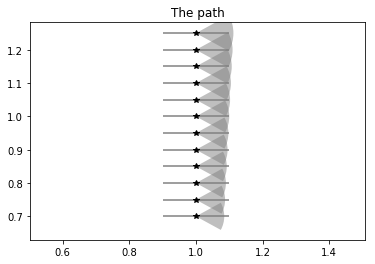
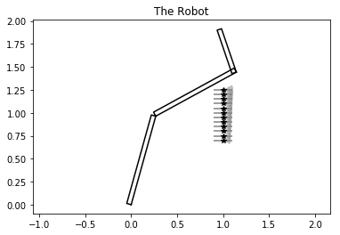
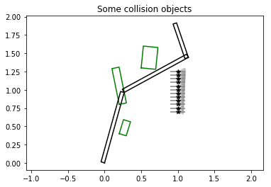
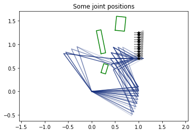
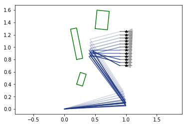
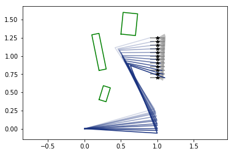
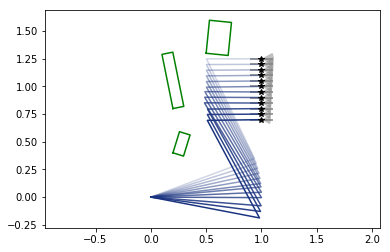
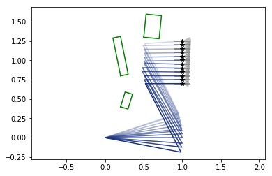
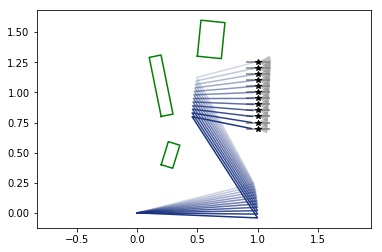

Example for a three link revolute robot
=======================================

.. code:: ipython3

    import numpy as np
    import matplotlib.pyplot as plt

Create a path for the robot to follow
-------------------------------------

.. code:: ipython3

    from ppr.path import TrajectoryPt, TolerancedNumber

.. code:: ipython3

    # create tolerances for x-position and orientation
    dx    = TolerancedNumber(1, 0.9, 1.1, samples=3)
    angle = TolerancedNumber(0.0, -0.5, 0.5, samples=5)
    
    # create a list with path points
    path1 = []
    n_path = 12
    for i in range(n_path):
        yi = 0.7 + i * 0.6 / n_path
        path1.append(TrajectoryPt([dx, yi, angle]))

.. code:: ipython3

    fig1, ax1 = plt.subplots()
    plt.title("The path")
    ax1.axis('equal')
    for tp in path1: tp.plot(ax1)
    plt.show()

Create a robot to follow the path
---------------------------------

.. code:: ipython3

    from ppr.robot import Robot_3R

.. code:: ipython3

    # create a robot with link lengths 1, 1 and 0.5
    robot1 = Robot_3R([1, 1, 0.5])

.. code:: ipython3

    fig2, ax2 = plt.subplots()
    plt.title("The Robot")
    ax2.axis('equal')
    robot1.plot(ax2, [1.3, -0.8, 1.4], 'k')
    for tp in path1: tp.plot(ax2)
    plt.show()

Create rectangle collision objects around the robot
---------------------------------------------------

.. code:: ipython3

    from ppr.geometry import Rectangle

.. code:: ipython3

    sc1 = [Rectangle(0.2, 0.4, 0.1, 0.2, -0.3),
           Rectangle(0.2, 0.8, 0.1, 0.5, 0.2),
           Rectangle(0.5, 1.3, 0.2, 0.3, -0.1)]

.. code:: ipython3

    fig3, ax3 = plt.subplots()
    plt.title("Some collision objects")
    ax3.axis('equal')
    for r in sc1: r.plot(ax3, 'g')
    for tp in path1: tp.plot(ax3)
    robot1.plot(ax3, [1.3, -0.8, 1.4], 'k')
    plt.show()

Sampling based motion planning
==============================

Now discretise the problem
--------------------------

The tolerenced trajectory points are converted to a list of poses. Then
for all these poses the inverse kinematics are solved.

.. code:: ipython3

    from ppr.path import cart_to_joint
    path_js = cart_to_joint(robot1, path1, check_collision=True, scene=sc1)

.. code:: ipython3

    # plot the different joint solution for the first trajectory point
    fig4, ax4 = plt.subplots()
    plt.title("Some joint positions")
    ax4.axis('equal')
    robot1.plot_path_kinematics(ax4, path_js[0])
    for r in sc1: r.plot(ax4, 'g')
    for tp in path1: tp.plot(ax4)
    plt.show()

Graph search
------------

.. code:: ipython3

    from ppr.path import get_shortest_path

.. code:: ipython3

    sol = get_shortest_path(path_js)
    print(sol['success'])

.. parsed-literal::

    converting type of Q
    [0 1 1 2 2 2 3 2 2 1 1 0]
    True

.. code:: ipython3

    fig5, ax5 = plt.subplots()
    ax5.axis('equal')
    robot1.plot_path_kinematics(ax5, sol['path'])
    for r in sc1: r.plot(ax5, 'g')
    for tp in path1: tp.plot(ax5)
    plt.show()

Optimisation based path following
=================================

.. code:: ipython3

    from ppr.optim import get_optimal_trajectory

.. code:: ipython3

    # use the solution of the sampling based method as initial value
    q_init = sol['path']
    # dymanics are not implemented at the moment, dq and dqq are quit useless for now
    q_opt, dq_opt, ddq_opt = get_optimal_trajectory(robot1, path1, q_init)

.. parsed-literal::

    Positive directional derivative for linesearch    (Exit mode 8)
                Current function value: 0.9055351457500107
                Iterations: 74
                Function evaluations: 2900
                Gradient evaluations: 70

.. code:: ipython3

    fig6, ax6 = plt.subplots()
    ax6.axis('equal')
    robot1.plot_path_kinematics(ax6, q_opt)
    for r in sc1: r.plot(ax6, 'g')
    for tp in path1: tp.plot(ax6)
    plt.show()

We can also choose to stay close to the nominal value of the trajectory
points

.. code:: ipython3

    weights = w={'joint_motion': 0.0, 'path_error': 1.0, 'torque': 0.0}
    q_opt2, dq_opt, ddq_opt = get_optimal_trajectory(robot1, path1, q_init, w=weights)

.. parsed-literal::

    Optimization terminated successfully.    (Exit mode 0)
                Current function value: 3.304098610241336e-07
                Iterations: 31
                Function evaluations: 1179
                Gradient evaluations: 31

.. code:: ipython3

    fig7, ax7 = plt.subplots()
    ax7.axis('equal')
    robot1.plot_path_kinematics(ax7, q_opt2)
    for r in sc1: r.plot(ax7, 'g')
    for tp in path1: tp.plot(ax7)
    plt.show()

Repeat, but with collision checking
~~~~~~~~~~~~~~~~~~~~~~~~~~~~~~~~~~~

Notice the upper part of the path changes.

.. code:: ipython3

    weights = w={'joint_motion': 0.0, 'path_error': 1.0, 'torque': 0.0}
    q_opt2, dq_opt, ddq_opt = get_optimal_trajectory(robot1, path1, q_init,
                                                     check_collision=True, scene=sc1,
                                                     w=weights)

.. parsed-literal::

    Optimization terminated successfully.    (Exit mode 0)
                Current function value: 1.974442584120712e-05
                Iterations: 31
                Function evaluations: 1197
                Gradient evaluations: 31

.. code:: ipython3

    fig7, ax7 = plt.subplots()
    ax7.axis('equal')
    robot1.plot_path_kinematics(ax7, q_opt2)
    for r in sc1: r.plot(ax7, 'g')
    for tp in path1: tp.plot(ax7)
    plt.show()

Untested minimal torque objective
---------------------------------

.. code:: ipython3

    robot1.set_link_inertia([1, 1, 1], [0.5, 0.5, 0.25], [0.05, 0.05, 0.05])
    weights = w={'joint_motion': 0.0, 'path_error': 0.0, 'torque': 1.0}
    q_opt3, dq_opt, ddq_opt = get_optimal_trajectory(robot1, path1, q_init, w=weights)

.. parsed-literal::

    Optimization terminated successfully.    (Exit mode 0)
                Current function value: 6.181791904677063e-05
                Iterations: 41
                Function evaluations: 1616
                Gradient evaluations: 41

.. code:: ipython3

    fig8, ax8 = plt.subplots()
    ax8.axis('equal')
    robot1.plot_path_kinematics(ax8, q_opt3)
    for r in sc1: r.plot(ax8, 'g')
    for tp in path1: tp.plot(ax8)
    plt.show()

